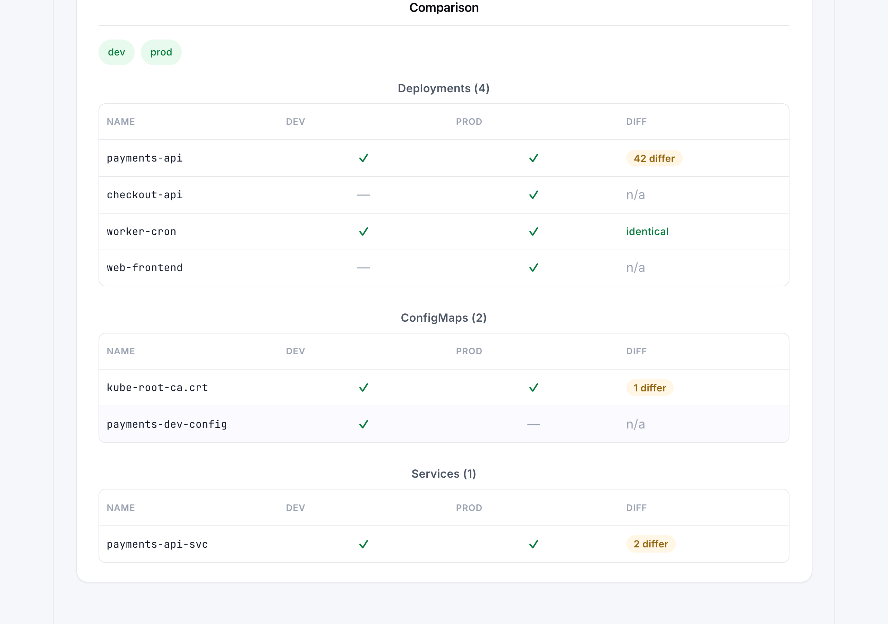
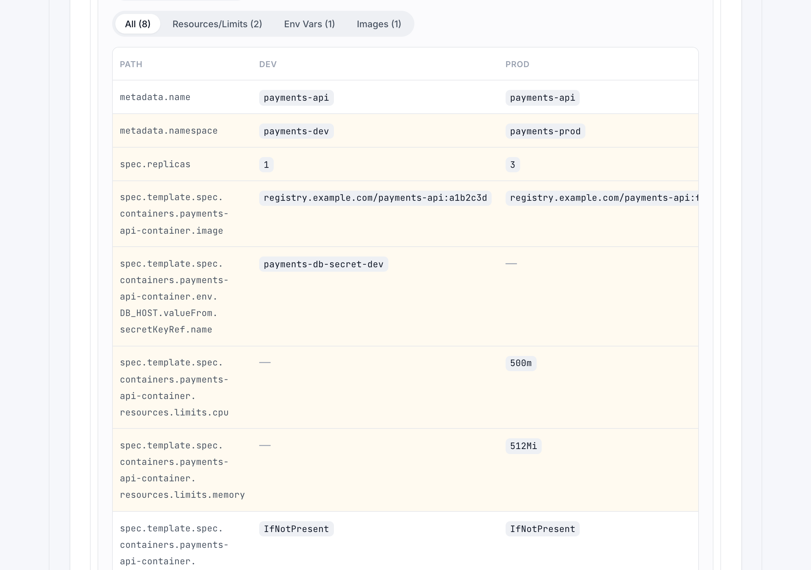
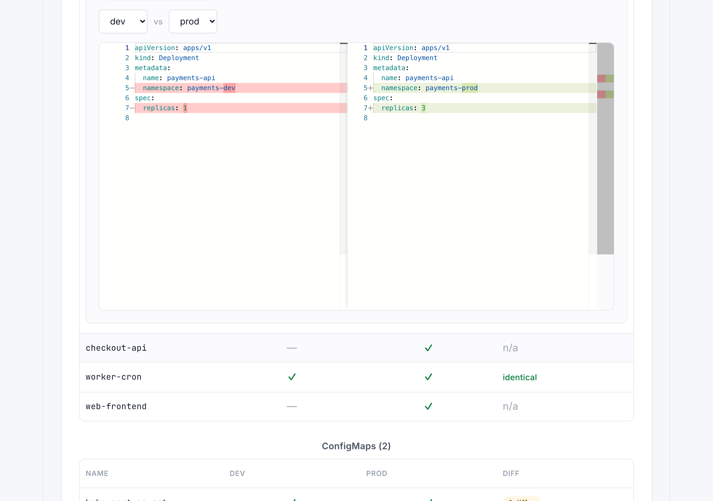
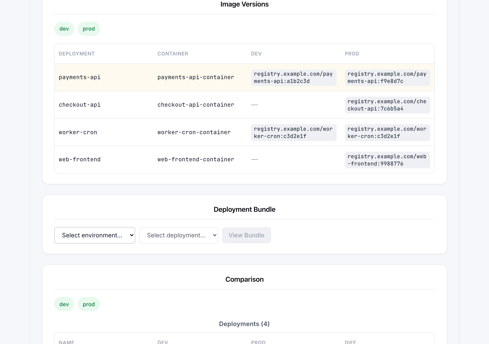
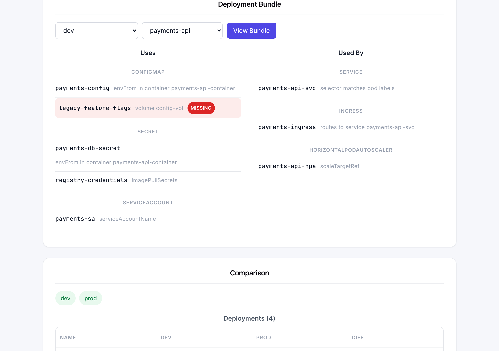

# D8s

Compare Kubernetes resources — Deployments, ConfigMaps, Secrets, Services, Ingresses,
PDBs, HPAs, and more — across multiple environments (any mix of clusters and
namespaces from your kubeconfig), right in the browser.

An **environment** is just a `(kubeconfig context, namespace)` pair, so this covers
dev vs. staging vs. prod on the same cluster, or entirely different clusters, or any
mix of both.

## What it does

- **Multi-environment comparison** — pick any set of environments and see, for every
  resource kind, what's present/missing in each one and how many fields differ.
- **Field-level diff** — drill into any matched resource to see a path-by-path
  comparison across environments, with filters for probes, resource limits, env
  vars, volumes, images, and config data.
- **YAML side-by-side diff** — the same comparison as a Monaco diff editor, for any
  two environments.
- **Image versions report** — a single table of every deployment's container image
  tag across environments, so you can spot version drift at a glance without
  drilling into each resource individually.
- **Deployment bundle view** — pick a deployment and see everything it references
  (ConfigMaps, Secrets, ServiceAccount, PriorityClass — walked from its pod spec)
  and everything that references it back (Services, Ingresses, PDBs, HPAs — matched
  by label selector or `scaleTargetRef`), including a call-out for dangling
  references that point at something that doesn't exist.
- **Safe by default** — Secret values are hashed server-side before they're ever
  sent to the browser. You can tell two secrets differ; you never see their content.

Resources are matched across environments by name, with automatic handling for
naming conventions that bake the environment into the name itself (e.g.
`payments-dev` and `payments-prod` are recognized as the same logical resource).

## Screenshots

**Comparing environments** — resource-by-resource presence and diff count:



**Field-level diff** — every differing path, side by side:



**YAML diff** — the same comparison as a Monaco diff editor:



**Image versions** — every deployment's image tag across environments in one table:



**Deployment bundle** — what a deployment uses and what uses it back, including
dangling references:



## Prerequisites

- **Node.js 20+** (built and tested on Node 25)
- A working **kubeconfig** (`~/.kube/config` or `$KUBECONFIG`) with the contexts you
  want to compare
- Whatever auth plugin your contexts need already installed and working via
  `kubectl` — e.g. the `aws` CLI for EKS (`aws eks get-token`), `kubelogin` for AKS.
  D8s shells out to exactly what's configured in your kubeconfig; it doesn't do
  cluster auth itself.

## Running it

### From a release bundle (no npm install needed)

Grab the `d8s-<version>.tgz` from the
[releases page](https://github.com/vamsinirala/d8s/releases), then:

```bash
tar -xzf d8s-<version>.tgz
cd d8s-<version>
./start.sh          # start.cmd on Windows
```

The bundle contains the built app plus all runtime dependencies (pure JS — the
same tarball works on macOS, Linux, and Windows). Only Node.js 20+ is needed.
It serves on `http://localhost:4173` and opens your browser.

### From source

```bash
git clone https://github.com/vamsinirala/d8s.git
cd d8s
npm install
npm run dev
```

This starts two processes:

- the API server (Fastify) on `http://localhost:4173`
- the frontend (Vite) on `http://localhost:5183` — open this one in your browser

### Production-style single-process run

```bash
npm run build
npm run start
```

This builds both the frontend and the server, then serves everything (API + built
UI) from one process on `http://localhost:4173`, and opens your browser
automatically.

## How environments and resources are stored

- Environments you add are saved locally to `~/.d8s/environments.json` — nothing is
  sent anywhere except to your own kubeconfig's clusters.
- There's no database. Every comparison fetches live from the cluster(s) you select.

## Project layout

```
server/   Fastify API — kubeconfig discovery, resource fetch/normalize, the diff
          engine, the deployment reference-graph resolver
web/      Vite + React frontend
```

See [PLAN.md](PLAN.md) for the detailed build history, design decisions, and known
gotchas.
